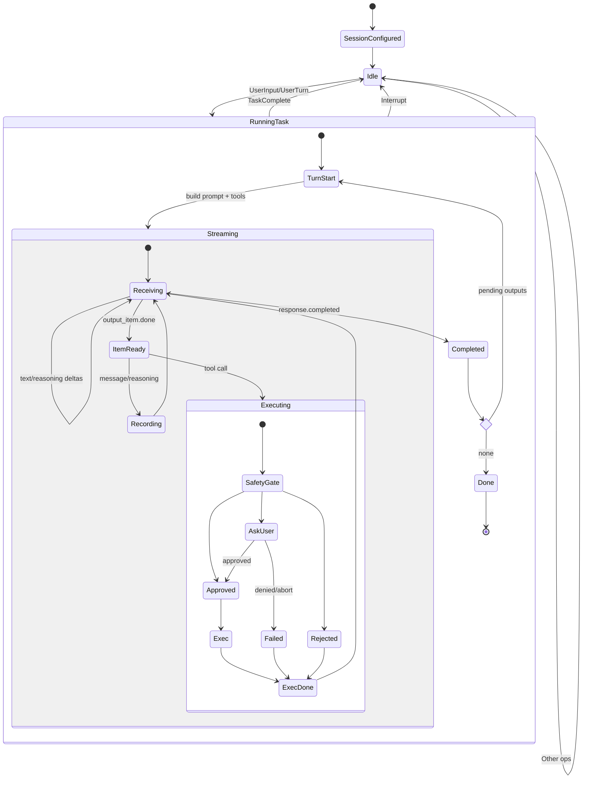

# Codex AI Agent Loop

This document explains the agent loop in the Rust implementation (the `codex-core` crate) and how Codex constructs and maintains the model’s context across turns. It focuses on the AI logic: how a task runs, how tool calls are executed and fed back, and what the model sees each turn.

- Core file: `codex-rs/core/src/codex.rs`
- Client/streaming: `codex-rs/core/src/client.rs`, `codex-rs/core/src/chat_completions.rs`, `codex-rs/core/src/client_common.rs`
- Tools: `codex-rs/core/src/openai_tools.rs`, `codex-rs/core/src/exec.rs`, `codex-rs/core/src/mcp_tool_call.rs`, `codex-rs/core/src/tool_apply_patch.rs`, `codex-rs/core/src/plan_tool.rs`
- Context helpers: `codex-rs/core/src/environment_context.rs`, `codex-rs/core/src/project_doc.rs`, `codex-rs/core/src/message_history.rs`

## High‑Level Flow

- A `Session` owns mutable agent state (history, pending inputs, approvals) and a persistent `TurnContext` (model client, tool config, sandbox/approval policy, cwd).
- The UI/CLI sends `Op` submissions; `submission_loop` handles them. A user message spawns an `AgentTask`, which runs one or more model turns until completion or interruption.
- Each turn builds a `Prompt` from conversation history + new inputs, plus the tool list. The `ModelClient` streams output events. Tool calls are executed locally, and their outputs are recorded and supplied back to the model on the next turn.
- When a turn yields a plain assistant message (no tool call needing follow‑up), the task ends and Codex emits `TaskComplete`.

## What Context the Model Sees

Each model turn receives a Prompt with:

- Base instructions: `prompt.md` (automatically included). For certain models, apply‑patch tooling instructions are appended when needed.
- Optional user instructions: from the config and project docs (concatenated `AGENTS.md` files), wrapped as a tagged user message via `Prompt::format_user_instructions_message`.
- Environment context: a tagged user message describing `cwd`, approval and sandbox policy, network access, and user shell. Constructed with `EnvironmentContext::new(...).into()`; serialized XML is wrapped between `<environment_context>...</environment_context>` tags.
- Conversation history: all prior `ResponseItem`s in order, including prior messages and prior tool calls with their outputs, maintained by `ConversationHistory`.
- Tools: JSON tool definitions built by `get_openai_tools(...)` based on model family and config. Includes shell execution (default or local/streamable), `update_plan`, optional `apply_patch` (function or freeform), web‑search preview, `view_image`, and any MCP tools discovered from configured servers.
- Storage flags: `store` toggles server‑side response storage; `prompt_cache_key` is the session id. Reasoning controls are included when supported by the model family.

## Turn Execution

- Build tools + prompt from history and current inputs.
- Stream model events with `ModelClient::stream(&prompt)`; Codex handles both OpenAI Responses and Chat Completions wire formats, unifying them into internal `ResponseEvent`s.
- While streaming:
  - `response.output_text.delta` → `AgentMessageDelta`
  - `reasoning_summary_text.delta` → `AgentReasoningDelta`; `reasoning_summary_part.added` → `AgentReasoningSectionBreak`
  - Optional raw/thinking stream (`reasoning_text.delta`) when enabled → `AgentReasoningRawContentDelta`
  - `response.output_item.done` yields a finalized `ResponseItem` (assistant message, function call, custom tool call, local shell call, web search call, reasoning, etc.).
  - On `response.completed`, Codex emits `TokenCount` and a `TurnDiff` (unified diff) if any patches were applied.

Codex collects the finalized `ResponseItem`s for the turn. For each item:

- Assistant message → forwarded to UI and recorded in history.
- Reasoning summary/content → forwarded and optionally recorded (when shown).
- Function call (e.g., `shell`, `apply_patch`, `view_image`, `exec_command`) → executed locally (see Tool Calls below); the produced `ResponseInputItem` is queued for the next turn and both call and result are recorded in history.
- Custom tool call (MCP) → executed via `McpConnectionManager`; result queued/recorded.
- Web search call preview → forwarded as `WebSearchBegin`/`WebSearchEnd` events.

If, after processing all streamed items, there are no pending `ResponseInputItem`s to send back, the turn is considered complete and the task ends. Otherwise, Codex queues those outputs as the next turn’s input and continues. In practice, Codex records both the tool call and its output into the conversation history; because each subsequent request sends the entire history as the `input`, the model receives those outputs implicitly on the next turn (no special “ephemeral” injection is required).

Note: when the user interrupts and sends a new message while there are outstanding tool calls, Codex synthesizes aborted outputs for missing call ids on the next request so every in‑flight call receives a response before the conversation proceeds.

## Tool Calls and Execution

Shell and apply‑patch are the two most common tools; others follow similar patterns.

- Safety gating: `assess_command_safety` evaluates the proposed command against the session’s approval policy, sandbox policy, and any commands previously approved for the session.
  - Auto‑approved → run in the selected sandbox (Seatbelt on macOS, seccomp/landlock on Linux) or unsandboxed, per policy.
  - Ask user → emit `ExecApprovalRequest`; upon approval, optionally remember for session and run unsandboxed; on denial/abort return a failure payload to the model.
  - Reject → immediately return a failure payload to the model.
- Execution: `process_exec_tool_call` spawns the command under the chosen sandbox. While running, Codex streams `ExecCommandBegin` and incremental `ExecCommandOutputDelta` events; on completion it emits `ExecCommandEnd` (or `PatchApplyBegin/End` for apply‑patch).
- Output framing: Codex forwards full stdout and stderr streams to the UI. For the model, it returns a summarized, head+tail‑truncated string bounded by byte/line limits so prompts remain within the model context window.
- Apply‑patch: If the function call is `apply_patch` or a shell command that resolves to Codex’s patch tool, Codex verifies/parses the patch, asks for approval if needed, applies it atomically, emits a patch diff event, and returns a structured success/failure payload. When verified and explicitly approved, the patch path runs without sandbox.
- MCP tools: `handle_mcp_tool_call` invokes the remote tool, emits `McpToolCallBegin/End` (with duration and result), and returns a `McpToolCallOutput` to feed back into the next turn.
- View image: attaches a local image path to the conversation context for that turn.

## Interrupts, Overrides, and Notifications

- Interrupts: `Op::Interrupt` aborts the running task; Codex clears pending approvals/inputs and emits `TurnAborted`.
- Turn‑scoped overrides: `Op::OverrideTurnContext` lets the UI switch model, reasoning effort/summary, cwd, and sandbox/approval policy for subsequent turns; an updated `<environment_context>` message is recorded.
- Per‑turn overrides: `Op::UserTurn` applies overrides only for that turn.
- Notifications: when configured, Codex spawns the notifier command after each completed turn with a JSON payload summarizing the turn.

## State Diagram

## Event Timeline per Turn (typical)

- `TaskStarted`
- `AgentMessageDelta` and/or `AgentReasoningDelta` (streaming)
- `WebSearchBegin` (optional)
- `ExecCommandBegin` → `ExecCommandOutputDelta` → `ExecCommandEnd` (or patch events)
- `AgentMessage` (final assistant message, when applicable)
- `TurnDiff` (if any file changes)
- `TokenCount`
- `TaskComplete` (when the task ends)

## Where to Look in Code

- Session creation and submissions: `Codex::spawn`, `submission_loop`, `Session::new`
- Turn loop: `run_task`, `run_turn`, `try_run_turn`, `drain_to_completed`
- Tool handling: `handle_function_call`, `handle_custom_tool_call`, `handle_container_exec_with_params`
- Safety/sandboxing: `assess_command_safety`, `assess_safety_for_untrusted_command`, `exec.rs`, `seatbelt.rs`, `landlock.rs`
- Context assembly: `Prompt::get_full_instructions`, `Prompt::format_user_instructions_message`, `EnvironmentContext`
- Tools list: `openai_tools::get_openai_tools`
- Reasoning stream plumbing: `client_common::ResponseEvent`, `chat_completions.rs` aggregator

## Notes

- Codex keeps the UI stream untruncated (full stdout/stderr and reasoning deltas) while keeping the model‑facing echo of exec output bounded for context window safety.
- When using the Responses API with `store = true`, the upstream server stores responses; otherwise, Codex sends full context each turn and requests encrypted reasoning content.
- For models that emit local shell calls natively (local_shell), Codex normalizes them into the standard execution path.
